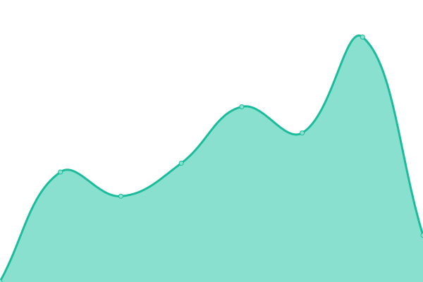
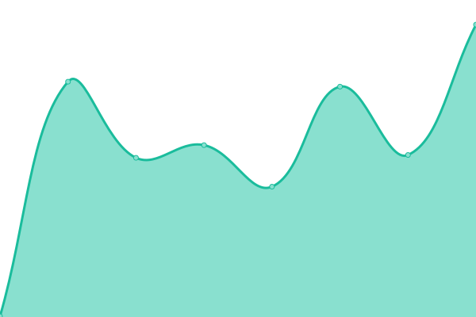
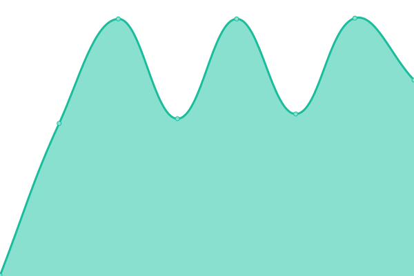
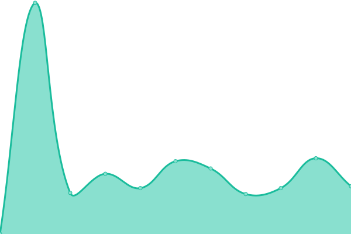

# [📈 Live Status](https://uptime.okp4.network): <!--live status--> **🟩 All systems operational**

This repository contains the open-source uptime monitor and status page for [OKP4 – Open Knowledge Protocol For](https://okp4.network), powered by [Upptime](https://github.com/upptime/upptime).

With [Upptime](https://upptime.js.org), you can get your own unlimited and free uptime monitor and status page, powered entirely by a GitHub repository. We use [Issues](https://github.com/okp4/uptime/issues) as incident reports, [Actions](https://github.com/okp4/uptime/actions) as uptime monitors, and [Pages](https://uptime.okp4.network) for the status page.

<!--start: status pages-->
<!-- This summary is generated by Upptime (https://github.com/upptime/upptime) -->
<!-- Do not edit this manually, your changes will be overwritten -->
<!-- prettier-ignore -->
| URL | Status | History | Response Time | Uptime |
| --- | ------ | ------- | ------------- | ------ |
|  [OKP4 Web Site](https://okp4.network) | 🟩 Up | [okp-4-web-site.yml](https://github.com/okp4/status/commits/HEAD/history/okp-4-web-site.yml) | 

 655ms
     
 | 

<a href="https://uptime.okp4.network/history/okp-4-web-site">100.00%</a>
    

|  [OKP4 Documentation Site](https://docs.okp4.network) | 🟩 Up | [okp-4-documentation-site.yml](https://github.com/okp4/status/commits/HEAD/history/okp-4-documentation-site.yml) | 

 444ms
     
 | 

<a href="https://uptime.okp4.network/history/okp-4-documentation-site">100.00%</a>
    

|  [OKP4 Faucet](https://faucet.okp4.network) | 🟩 Up | [okp-4-faucet.yml](https://github.com/okp4/status/commits/HEAD/history/okp-4-faucet.yml) | 

 546ms
     
 | 

<a href="https://uptime.okp4.network/history/okp-4-faucet">100.00%</a>
    

|  [OKP4 Explorer](https://explore.okp4.network) | 🟩 Up | [okp-4-explorer.yml](https://github.com/okp4/status/commits/HEAD/history/okp-4-explorer.yml) | 

 616ms
     
 | 

<a href="https://uptime.okp4.network/history/okp-4-explorer">100.00%</a>
    

|  [Nemeton Program Web Site](https://nemeton.okp4.network) | 🟩 Up | [nemeton-program-web-site.yml](https://github.com/okp4/status/commits/HEAD/history/nemeton-program-web-site.yml) | 

 722ms
     
 | 

<a href="https://uptime.okp4.network/history/nemeton-program-web-site">100.00%</a>
    

|  [RPC okp4-nemeton-1](https://api.testnet.okp4.network/cosmos/base/tendermint/v1beta1/blocks/latest) | 🟩 Up | [rpc-okp4-nemeton-1.yml](https://github.com/okp4/status/commits/HEAD/history/rpc-okp4-nemeton-1.yml) | 

 751ms
     
 | 

<a href="https://uptime.okp4.network/history/rpc-okp4-nemeton-1">100.00%</a>
    

<!--end: status pages-->

[**Visit our status website →**](https://uptime.okp4.network)

## 📄 License

- Powered by: [Upptime](https://github.com/upptime/upptime)
- Code: [MIT](./LICENSE) © [OKP4 – Open Knowledge Protocol For](https://okp4.network)
- Data in the `./history` directory: [Open Database License](https://opendatacommons.org/licenses/odbl/1-0/)
