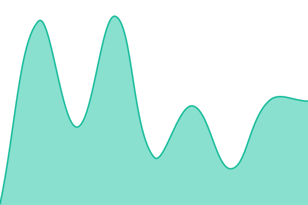
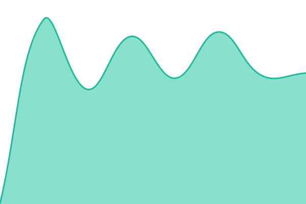
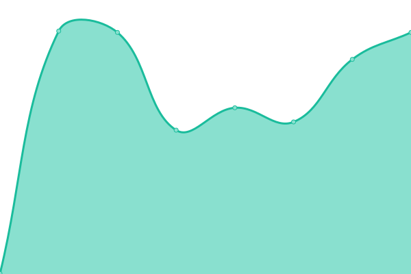

# [📈 Live Status](https://status.axone.xyz): <!--live status--> **🟩 All systems operational**

This repository contains the open-source uptime monitor and status page for [Axone](https://axone.xyz) protocol.

<!--start: status pages-->
<!-- This summary is generated by Upptime (https://github.com/upptime/upptime) -->
<!-- Do not edit this manually, your changes will be overwritten -->
<!-- prettier-ignore -->
| URL | Status | History | Response Time | Uptime |
| --- | ------ | ------- | ------------- | ------ |
|  [Axone Web Site](https://axone.xyz) | 🟩 Up | [axone-web-site.yml](https://github.com/axone-protocol/status/commits/HEAD/history/axone-web-site.yml) | 

 195ms
     
 | 

<a href="https://status.axone.xyz/history/axone-web-site">100.00%</a>
    

|  [Axone Documentation Site](https://docs.axone.xyz) | 🟩 Up | [axone-documentation-site.yml](https://github.com/axone-protocol/status/commits/HEAD/history/axone-documentation-site.yml) | 

 107ms
     
 | 

<a href="https://status.axone.xyz/history/axone-documentation-site">100.00%</a>
    

|  [Axone Agentic Airdrop Web Site](https://airdrop.axone.xyz) | 🟩 Up | [axone-agentic-airdrop-web-site.yml](https://github.com/axone-protocol/status/commits/HEAD/history/axone-agentic-airdrop-web-site.yml) | 

 1122ms
     
 | 

<a href="https://status.axone.xyz/history/axone-agentic-airdrop-web-site">100.00%</a>
    

|  [Axone Faucet](https://faucet.axone.xyz) | 🟩 Up | [axone-faucet.yml](https://github.com/axone-protocol/status/commits/HEAD/history/axone-faucet.yml) | 

 590ms
     
 | 

<a href="https://status.axone.xyz/history/axone-faucet">100.00%</a>
    

|  [Axone Explorer](https://explore.axone.xyz) | 🟩 Up | [axone-explorer.yml](https://github.com/axone-protocol/status/commits/HEAD/history/axone-explorer.yml) | 

 508ms
     
 | 

<a href="https://status.axone.xyz/history/axone-explorer">100.00%</a>
    

|  [S3 Axone](https://s3.axone.xyz/you_shall_not_pass.gandalf) | 🟩 Up | [s3-axone.yml](https://github.com/axone-protocol/status/commits/HEAD/history/s3-axone.yml) | 

 548ms
     
 | 

<a href="https://status.axone.xyz/history/s3-axone">100.00%</a>
    

|  [Nemeton Program Web Site](https://nemeton.okp4.network) | 🟩 Up | [nemeton-program-web-site.yml](https://github.com/axone-protocol/status/commits/HEAD/history/nemeton-program-web-site.yml) | 

 978ms
     
 | 

<a href="https://status.axone.xyz/history/nemeton-program-web-site">100.00%</a>
    

<!--end: status pages-->

[**Visit our status website →**](https://status.axone.xyz)

## Repository Structure

This repository is powered 💪 by [Upptime](https://github.com/upptime/upptime) for the operational monitoring of [Axone](https://axone.xyz) services.

> [Upptime](https://upptime.js.org) provides a powerful framework for uptime monitoring and generating status pages directly from a GitHub repository. It offers an open-source solution for tracking uptime metrics and automating status page updates.

Key Components:

- **Incident Reports**: We manage incident reports using [GitHub Issues](https://github.com/axone-protocol/status/issues).
- **Uptime Monitoring**: Our uptime checks are automated through [GitHub Actions](https://github.com/axone-protocol/status/actions).
- **Status Page**: The live status of our services can be found at our [Status Page](https://status.axone.xyz), which is dynamically generated using GitHub Pages.

## ⚖️ License Information

This repository contains different types of materials, each under its own license:

- Materials derived from [Upptime](https://github.com/upptime/upptime) are licensed under the [MIT License](./LICENSE-UPPTIME).
- Materials originating from [Axone](https://axone.xyz) are licensed under the [BSD 3-Clause License](./LICENSE).
- Data within the `./history` directory is made available under the [Open Database License (ODbL)](./LICENSE-DATA).
