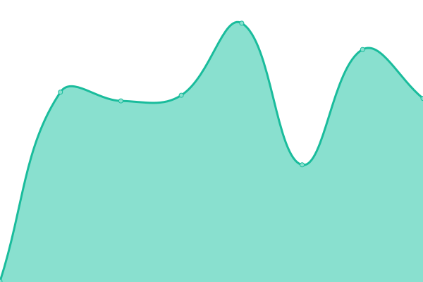

# [📈 Live Status](https://status.axone.xyz): <!--live status--> **🟧 Partial outage**

This repository contains the open-source uptime monitor and status page for [Axone](https://axone.xyz) protocol.

<!--start: status pages-->
<!-- This summary is generated by Upptime (https://github.com/upptime/upptime) -->
<!-- Do not edit this manually, your changes will be overwritten -->
<!-- prettier-ignore -->
| URL | Status | History | Response Time | Uptime |
| --- | ------ | ------- | ------------- | ------ |
|  [Axone Web Site](https://axone.xyz) | 🟩 Up | [axone-web-site.yml](https://github.com/axone-protocol/status/commits/HEAD/history/axone-web-site.yml) | 

 497ms
     
 | 

<a href="https://status.axone.xyz/history/axone-web-site">99.93%</a>
    

|  [Axone Documentation Site](https://docs.axone.xyz) | 🟩 Up | [axone-documentation-site.yml](https://github.com/axone-protocol/status/commits/HEAD/history/axone-documentation-site.yml) | 

 69ms
     
 | 

<a href="https://status.axone.xyz/history/axone-documentation-site">100.00%</a>
    

|  [Axone Faucet](https://faucet.okp4.network) | 🟥 Down | [axone-faucet.yml](https://github.com/axone-protocol/status/commits/HEAD/history/axone-faucet.yml) | 

 1022ms
     
 | 

<a href="https://status.axone.xyz/history/axone-faucet">95.38%</a>
    

|  [Axone Explorer](https://explore.axone.xyz) | 🟥 Down | [axone-explorer.yml](https://github.com/axone-protocol/status/commits/HEAD/history/axone-explorer.yml) | 

 398ms
     
 | 

<a href="https://status.axone.xyz/history/axone-explorer">95.39%</a>
    

|  [KatAI Landing Page](https://katai.axone.xyz) | 🟩 Up | [kat-ai-landing-page.yml](https://github.com/axone-protocol/status/commits/HEAD/history/kat-ai-landing-page.yml) | 

 276ms
     
 | 

<a href="https://status.axone.xyz/history/kat-ai-landing-page">99.93%</a>
    

|  [KatAI Web App](https://play.katai.axone.xyz) | 🟩 Up | [kat-ai-web-app.yml](https://github.com/axone-protocol/status/commits/HEAD/history/kat-ai-web-app.yml) | 

 91ms
     
 | 

<a href="https://status.axone.xyz/history/kat-ai-web-app">100.00%</a>
    

|  [KatAI backend](https://api.katai.axone.xyz) | 🟥 Down | [kat-ai-backend.yml](https://github.com/axone-protocol/status/commits/HEAD/history/kat-ai-backend.yml) | 

 458ms
     
 | 

<a href="https://status.axone.xyz/history/kat-ai-backend">95.39%</a>
    

|  [S3 Axone](https://s3.axone.xyz/you_shall_not_pass.gandalf) | 🟥 Down | [s3-axone.yml](https://github.com/axone-protocol/status/commits/HEAD/history/s3-axone.yml) | 

 408ms
     
 | 

<a href="https://status.axone.xyz/history/s3-axone">95.40%</a>
    

|  [Nemeton Program Web Site](https://nemeton.okp4.network) | 🟥 Down | [nemeton-program-web-site.yml](https://github.com/axone-protocol/status/commits/HEAD/history/nemeton-program-web-site.yml) | 

 817ms
     
 | 

<a href="https://status.axone.xyz/history/nemeton-program-web-site">95.40%</a>
    

|  [axone-dentrite - Axone node REST](https://api.dentrite.axone.xyz/cosmos/base/tendermint/v1beta1/blocks/latest) | 🟥 Down | [axone-dentrite-axone-node-rest.yml](https://github.com/axone-protocol/status/commits/HEAD/history/axone-dentrite-axone-node-rest.yml) | 

 525ms
     
 | 

<a href="https://status.axone.xyz/history/axone-dentrite-axone-node-rest">95.41%</a>
    

|  [axone-dentrite - Axone node RPC](https://api.dentrite.axone.xyz/rpc/block) | 🟥 Down | [axone-dentrite-axone-node-rpc.yml](https://github.com/axone-protocol/status/commits/HEAD/history/axone-dentrite-axone-node-rpc.yml) | 

 117ms
     
 | 

<a href="https://status.axone.xyz/history/axone-dentrite-axone-node-rpc">95.41%</a>
    

|  [axone-dentrite - Jayjay node REST](https://axone-api.jayjayinfra.space/cosmos/base/tendermint/v1beta1/blocks/latest) | 🟩 Up | [axone-dentrite-jayjay-node-rest.yml](https://github.com/axone-protocol/status/commits/HEAD/history/axone-dentrite-jayjay-node-rest.yml) | 

 854ms
     
 | 

<a href="https://status.axone.xyz/history/axone-dentrite-jayjay-node-rest">100.00%</a>
    

|  [axone-dentrite - Jayjay node RPC](https://axone-rpc.jayjayinfra.space/block) | 🟩 Up | [axone-dentrite-jayjay-node-rpc.yml](https://github.com/axone-protocol/status/commits/HEAD/history/axone-dentrite-jayjay-node-rpc.yml) | 

 670ms
     
 | 

<a href="https://status.axone.xyz/history/axone-dentrite-jayjay-node-rpc">100.00%</a>
    

|  [axone-dentrite - Jayjay node RPC - WSS](wss://axone-rpc.jayjayinfra.space/websocket) | 🟩 Up | [axone-dentrite-jayjay-node-rpc-wss.yml](https://github.com/axone-protocol/status/commits/HEAD/history/axone-dentrite-jayjay-node-rpc-wss.yml) | 

 0ms
     
 | 

<a href="https://status.axone.xyz/history/axone-dentrite-jayjay-node-rpc-wss">100.00%</a>
    

|  [Subquery GraphQL API nemeton-1](https://api.subquery.network/sq/okp4/nemeton-1) | 🟩 Up | [subquery-graph-ql-api-nemeton-1.yml](https://github.com/axone-protocol/status/commits/HEAD/history/subquery-graph-ql-api-nemeton-1.yml) | 

 985ms
     
 | 

<a href="https://status.axone.xyz/history/subquery-graph-ql-api-nemeton-1">99.79%</a>
    

<!--end: status pages-->

[**Visit our status website →**](https://status.axone.xyz)

## Repository Structure

This repository is powered 💪 by [Upptime](https://github.com/upptime/upptime) for the operational monitoring of [Axone](https://axone.xyz) services.

> [Upptime](https://upptime.js.org) provides a powerful framework for uptime monitoring and generating status pages directly from a GitHub repository. It offers an open-source solution for tracking uptime metrics and automating status page updates.

Key Components:

- **Incident Reports**: We manage incident reports using [GitHub Issues](https://github.com/axone-protocol/status/issues).
- **Uptime Monitoring**: Our uptime checks are automated through [GitHub Actions](https://github.com/axone-protocol/status/actions).
- **Status Page**: The live status of our services can be found at our [Status Page](https://status.axone.xyz), which is dynamically generated using GitHub Pages.

## ⚖️ License Information

This repository contains different types of materials, each under its own license:

- Materials derived from [Upptime](https://github.com/upptime/upptime) are licensed under the [MIT License](./LICENSE-UPPTIME).
- Materials originating from [Axone](https://axone.xyz) are licensed under the [BSD 3-Clause License](./LICENSE).
- Data within the `./history` directory is made available under the [Open Database License (ODbL)](./LICENSE-DATA).
